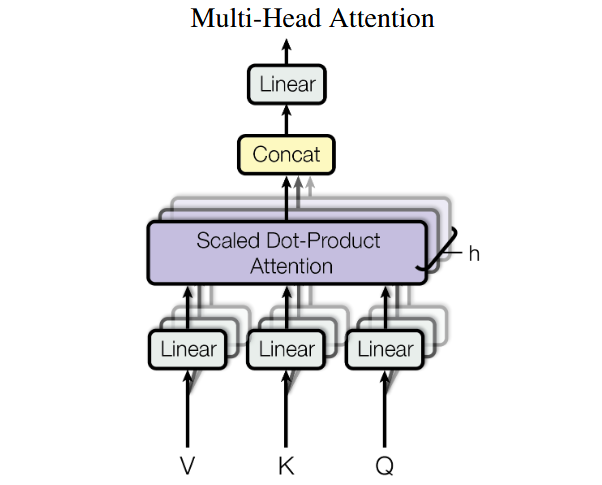
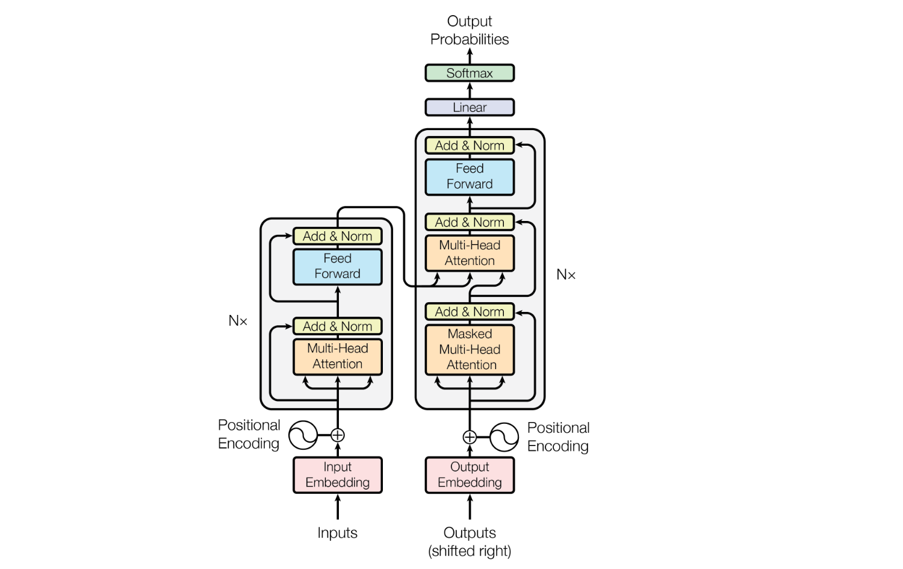

Transformer 是一种处理**序列**的神经网络架构。文本、代码、语音、时间序列都可以看成序列；如今的 BERT、GPT、T5 等模型都以它为基础。

它最重要的能力是：处理某个 token 时，可以直接参考序列中所有相关 token，并为不同位置分配不同的关注程度。

> 例如：`小明把书放到桌子上，因为它很重。`
>
> 理解“它”时，模型应该更多关注“书”，而不是只看前一个词“因为”。

---

## 1. 要解决的问题

在 Transformer 之前，常用 RNN / LSTM 处理文本。它们按顺序读入 token：

```text
我 → 喜欢 → 学习 → 深度 → 学习
```

这带来两个问题：

1. **难并行**：第 4 个 token 的计算依赖第 3 个，训练时无法一次处理整句。
2. **远距离信息容易衰减**：句首的信息要经过很多步才能影响句尾。

Transformer 去掉循环结构，改为让一句话中的 token 彼此“看一眼”。这样同一层的所有位置能并行计算，远处 token 之间也只需一次注意力计算就能建立联系。

代价是标准自注意力需要比较任意两个位置，长度为 $n$ 时的计算与显存开销约为 $O(n^2)$；上下文很长时会变贵。

---

## 2. 统一名词

### token 和 embedding

模型不直接读汉字或英文单词，而是先把文本切成 token，再将每个 token 查表变成一个向量（embedding）。

```text
“我 喜欢 学习”
      ↓ tokenizer
[15496, 43921, 7220]
      ↓ embedding table
[x1, x2, x3]，每个 xi 是长度为 d_model 的向量
```

下面约定输入矩阵为 $X \in \mathbb{R}^{n \times d_{model}}$：

- $n$：序列长度
- $d_{model}$：每个 token 表示的维度

### 为什么还需要位置信息？

自注意力只关心向量之间的关系，本身不知道 token 的先后。因此 `我喜欢你` 和 `你喜欢我` 若只交换输入顺序，注意力机制无法天然知道哪个在前。

解决方式是在词向量上加**位置编码**：

$$H_0 = \text{TokenEmbedding} + \text{PositionEmbedding}$$

原始论文使用固定的正弦/余弦位置编码；现代模型也常使用可学习位置编码或 RoPE（旋转位置编码）。目的相同：让表示中带有相对或绝对位置信号。

---

## 3. 核心：自注意力（Self-Attention）

可以把每个 token 想成在问：“为了更新我自己的表示，这句话里的谁最有用？”

对每个输入向量，模型通过三组可学习矩阵生成：

- **Query（Q，查询）**：我正在找什么信息？
- **Key（K，键）**：我能提供什么线索？
- **Value（V，值）**：如果你关注我，应取走什么内容？

$$Q=XW_Q, \qquad K=XW_K, \qquad V=XW_V$$

以“书”为例，它的 Query 会分别和所有 token 的 Key 做点积。结果越大，说明“书”越应关注该 token。

原论文给出的缩放点积注意力公式是：

$$\text{Attention}(Q,K,V)=\text{softmax}\left(\frac{QK^T}{\sqrt{d_k}}\right)V$$

在需要屏蔽某些位置时（例如 Decoder 不能偷看未来 token，或忽略 padding），工程实现会在 softmax **之前**给对应的分数加上掩码。把这一步写进公式，才得到常见的扩展形式：

$$\text{Attention}(Q,K,V)=\text{softmax}\left(\frac{QK^T}{\sqrt{d_k}} + M\right)V$$

其中允许关注的位置通常令 $M_{ij}=0$，禁止关注的位置令 $M_{ij}=-\infty$；这样 softmax 后被禁止位置的权重就会变成 0。`+M` 是带掩码时的实现写法，不是原论文展示的基础公式。

按顺序理解这个公式：

```text
QKᵀ              每个 token 对每个 token 的相关性分数
÷ √d_k           防止维度大时分数过大，使 softmax 过于极端
+ M（可选）       加入掩码：忽略 padding 或禁止偷看未来
softmax           每一行变成权重和为 1 的分布
权重 × V          对所有 token 的信息做加权求和
```


输出中每个位置仍是一个向量，但它已经融合了整个上下文的信息。这就是“自”注意力：Q、K、V 都来自同一序列。

### 一个极小例子

句子有三个 token：`猫 / 坐 / 垫子`。更新“坐”的表示时，注意力权重可能是：

```text
关注对象：   猫     坐     垫子
注意力权重：0.45   0.10   0.45
```

那么新的“坐”向量约等于 `0.45 × V(猫) + 0.10 × V(坐) + 0.45 × V(垫子)`。这些权重不是人工规则，而是训练得到的。

### 多头注意力（Multi-Head Attention）

只做一次注意力像只用一种“观察角度”。多头注意力会并行做 $h$ 次较小的注意力，再拼接并投影：

$$\text{MultiHead}(Q,K,V)=\text{Concat}(head_1,\ldots,head_h)W_O$$

原论文中的结构如下：先分别对 $Q$、$K$、$V$ 做线性投影，再并行计算 $h$ 个缩放点积注意力，最后将各个头的结果拼接（Concat）并通过一个线性层：



图中每个紫色模块代表一个注意力头；它们使用不同的投影参数，因此可以从不同角度计算 token 之间的关系。

不同头可能分别学到指代、语法依赖、邻近词、主题关联等模式。注意：这是一种常见解释，不应把某个头固定地理解为某种人类语言规则。

---

## 4. 一个 Transformer 层长什么样？

每层通常由两个子层组成：多头注意力与逐位置前馈网络（FFN）。

```text
输入 H
  │
  ├─ Multi-Head Attention
  │       │
  │   残差连接 + LayerNorm
  │       │
  ├─ Feed-Forward Network（每个位置独立、共享参数）
  │       │
  └─ 残差连接 + LayerNorm → 输出
```

FFN 通常是：

$$\text{FFN}(x)=W_2\,\sigma(W_1x+b_1)+b_2$$

它不在 token 之间传递信息，而是单独“加工”每个 token 的向量。注意力负责**信息交换**，FFN 负责**特征变换**。

残差连接可以理解为“保留原信息，再加上本层新学到的修正”；LayerNorm 让每层数值尺度更稳定，帮助深层网络训练。

---

## 5. 原始 Transformer：Encoder + Decoder

论文 *Attention Is All You Need* 的 Transformer 用于机器翻译，由编码器和解码器堆叠而成。

下面是原论文给出的完整结构图。左侧是重复 $N$ 次的 Encoder，右侧是重复 $N$ 次的 Decoder；底部输入 embedding 与位置编码相加后，依次经过注意力、前馈网络、残差连接和 LayerNorm。



```text
源语言：I love deep learning
        │
        ▼
  Encoder × N：双向 self-attention，理解整句
        │
        ▼
  Decoder × N：逐个生成目标语言 token
        │
        ▼
目标语言：我 喜欢 深度 学习
```

### Encoder

Encoder 的每个 token 都能关注输入中的所有 token，适合建立完整的上下文表示。

### Decoder

Decoder 有三部分：

1. **Masked self-attention**：生成第 $t$ 个 token 时，只能看见前 $t-1$ 个 token。
2. **Cross-attention（交叉注意力）**：Decoder 的 Q 来自当前已生成内容，K 和 V 来自 Encoder 输出，以便参考原句。
3. **FFN**：进一步变换表示。

掩码很关键。训练时虽然可以把目标句整个送进模型并行计算，但必须把未来位置遮住，否则模型会在预测答案时直接看到答案。

```text
允许关注的下三角掩码（1 表示可见）
1 0 0 0
1 1 0 0
1 1 1 0
1 1 1 1
```

最后，Decoder 输出经过线性层和 softmax，得到“下一个 token 是词表中每个 token 的概率”。

---

## 6. BERT、GPT 和 T5 的关系

| 模型家族 | 使用的主体 | 能看见哪些 token | 典型用途 |
| --- | --- | --- | --- |
| BERT | Encoder-only | 左右两边都能看 | 分类、检索、抽取、表征学习 |
| GPT | Decoder-only | 只能看左边已出现的 token | 对话、写作、代码生成 |
| T5 | Encoder-Decoder | 编码器双向；解码器因果遮罩 | 翻译、摘要、文本到文本任务 |

GPT 虽然只有 Decoder，但不意味着它“缺少理解能力”。它在大量“预测下一个 token”的训练中学习了语言与世界的统计规律；因果掩码只是规定它生成时不能看到未来文本。

---

## 7. 训练和生成到底在做什么？

以 GPT 类模型为例，训练目标是给定前文预测下一个 token：

```text
输入：  今天 天气 很
目标：  天气 很 好
```

对每个位置的预测分布与真实下一个 token 计算交叉熵损失，再通过反向传播更新所有参数。训练可对一整段文本并行计算。

生成时则无法完全并行：

```text
提示词 → 预测下一个 token → 拼回输入 → 再预测下一个 token → ...
```

这解释了一个现象：大模型训练效率很高，但连续生成长回答需要逐 token 推理。工程上常用 KV Cache 缓存先前位置的 K、V，避免每一步重复计算整个前缀。

---

## 8. 最小 PyTorch 实现：单头自注意力

下面的实现省略了多头、掩码、残差和归一化，只保留核心计算。输入形状为 `[batch, seq_len, d_model]`。

```python
import math
import torch
from torch import nn


class SelfAttention(nn.Module):
    def __init__(self, d_model):
        super().__init__()
        self.q_proj = nn.Linear(d_model, d_model, bias=False)
        self.k_proj = nn.Linear(d_model, d_model, bias=False)
        self.v_proj = nn.Linear(d_model, d_model, bias=False)

    def forward(self, x):
        q = self.q_proj(x)  # [B, N, D]
        k = self.k_proj(x)  # [B, N, D]
        v = self.v_proj(x)  # [B, N, D]

        scores = q @ k.transpose(-2, -1) / math.sqrt(q.size(-1))
        weights = scores.softmax(dim=-1)  # 每个 token 对所有 token 的权重
        return weights @ v


x = torch.randn(2, 5, 16)
print(SelfAttention(16)(x).shape)  # torch.Size([2, 5, 16])
```

---

## 9. 容易混淆的点

1. **注意力不是检索数据库。** 它对当前输入中的向量做可微分的加权组合；模型的知识储存在训练参数中。
2. **Transformer 并非天然理解顺序。** 位置编码是不可少的组成部分。
3. **Attention 权重不等于因果解释。** 某位置权重高，不严格证明它是模型作出判断的唯一原因。
4. **并行训练不等于并行生成。** 自回归模型生成时仍要依次预测。
5. **不是所有 Transformer 都是大语言模型。** Vision Transformer、语音 Transformer、时间序列 Transformer 都使用同一类思想。

---

## 10. 用自己的话复述

Transformer 的一层做两件事：

1. 用注意力让每个 token 从其他 token 收集自己需要的信息。
2. 用 FFN 单独加工收集后的信息。

多层重复后，token 的表示从“字面含义”逐步变成“结合上下文后的含义”。Encoder 用全局可见的注意力来理解输入；Decoder 用遮住未来的注意力来学习和执行下一个 token 预测。这就是 Transformer 能用于理解与生成任务的基本原因。

## 参考资料

- Vaswani et al., [Attention Is All You Need](https://arxiv.org/abs/1706.03762), 2017。
- Jay Alammar, [The Illustrated Transformer](https://jalammar.github.io/illustrated-transformer/)。
- 《动手学深度学习》：[Transformer](https://zh.d2l.ai/chapter_attention-mechanisms-and-transformers/transformer.html)。
