# VisionFM：面向通用眼科人工智能的多模态多任务视觉基础模型（中文版）

> **原文**：Qiu J, Wu J, Wei H, et al. *Development and Validation of a Multimodal Multitask Vision Foundation Model for Generalist Ophthalmic Artificial Intelligence.* NEJM AI，2024-11-27 发表（2023-10-30 收稿，2024-09-26 接收）。
> **本笔记**：`full.md`（英文全文，MinerU 解析）的中文学习版。正文按原章节完整译为中文，两张表格已由 HTML 转为标准 Markdown 表格；参考文献编号沿用原文，英文文献列表见 [[full|full.md]]。
> **共同一作**：邱嘉宁（Jianing Qiu）、吴坚（Jian Wu）、韦浩（Hao Wei）。**通讯**：王宁利 wningli@vip.163.com；袁武（Wu Yuan）wyuan@cuhk.edu.hk
> **代码/权重**：https://github.com/ABILab-CUHK/VisionFM
> 相关笔记：[[VisionFM 模型结构]] ｜ [[Vision_Transformer_ViT_简介]] ｜ [[visionFM日志]]

---

## 0. 一句话概览

VisionFM 是一个**眼科专用视觉基础模型**：用 **8 种眼科成像模态、340 万张图像（56 万余名参与者）**做自监督预训练（每种模态一个 ViT 编码器，iBOT 方案），再挂任务专用解码器完成分类、分级、回归、分割、关键点检测等下游任务；在 **53 个公开 + 12 个私有数据集**上验证，内部验证 8 类疾病 × 5 种模态的平均 AUROC 为 **0.950**，在 12 种眼病诊断上达到**接近中级眼科医生**的水平。

---

## 摘要

**背景**　专用的"单一用途、单一模态"模型，面对新疾病、新模态和新临床任务时，泛化能力往往有限甚至没有。基础模型（foundation model）面向多用途构建，即使没有为某个任务专门预训练，也能执行该任务，并能适配不同的临床应用场景。

**方法**　本文提出 VisionFM——一个眼科人工智能基础模型，预训练数据为来自 50 万余名个体的 **340 万张图像**，覆盖多样的眼科疾病、成像模态与设备以及临床场景。基于 8 种模态预训练后，在一个由 **53 个公开数据集与 12 个私有数据集**组成的眼科数据库上测试了多种应用，包括疾病筛查与检测、预后与预测、病灶与解剖结构分割，并与不同经验水平的眼科医生在眼科疾病与全身疾病诊断上做了对比。

**结果**

- **内部验证**：在诊断眼部疾病上优于基线深度学习方法，8 个疾病类别 × 5 种成像模态的平均 AUROC 为 **0.950（95% CI 0.941–0.959）**。
- **外部验证**：眼底糖网识别 AUROC **0.945（0.934–0.956）**；OCT 的年龄相关性黄斑变性（AMD）识别 AUROC **0.974（0.966–0.983）**。
- **与医生对比**：在基于眼底彩照诊断 12 种眼病的对照研究中，VisionFM 的诊断准确率接近中级眼科医生。
- **泛化能力**：可扩展到新的成像模态与设备，有效应对数据集偏移。例如在一个预训练阶段从未接触过的模态上做糖网分级，AUROC 达 **0.935（0.902–0.964）**。
- 此外，VisionFM 能**直接从眼底彩照**预测青光眼进展以及颅内肿瘤的存在。

**结论**　VisionFM 提供了一个高效平台，可用多种成像模态诊断或预测多种疾病；借助其开源的模型权重与代码库，可以扩展纳入更多数据、模态与应用。（资助：香港特别行政区研究资助局 RGC 等。）

---

## 引言

- 视力损害及导致它的主要眼病（白内障、AMD、青光眼等）在全球范围内普遍存在。到 **2050 年，预计有 4.74 亿人**可能出现中重度视力损害；高质量眼科医生严重短缺，在低收入国家尤为突出。
- 尽管已有大量眼科 AI 研究，但现有模型存在明显局限：**需要大量标注数据**（昂贵、低效）；大多只关注**单一或有限的疾病**；只用**单一成像模态**（如眼底彩照）；且是**任务专用**的（如糖网筛查），这限制了它们更广泛的临床应用（图 1A）。
- 面向公众开放的 AI 基础模型（如 GPT-4、SAM）在海量数据上训练，可适配解决广泛任务，为应对全球性眼科挑战提供了新机会。眼科领域的第一个基础模型 **RETFound** 展现了这种"通才智能"（从视网膜图像检测疾病），但它**只处理眼底彩照与 OCT**，覆盖的临床任务有限。
- 本文开发 **VisionFM**（图 1B）：用 340 万张多样化眼科图像预训练，覆盖多种眼科疾病、成像模态、设备与人群特征，可支持疾病筛查、诊断、表型亚分类、疾病进展预测、全身生物标志物检测等应用；具备**小样本（few-shot）诊断能力**并可泛化到未见过的数据。此外还证明：**通过图灵测试的高质量合成眼科数据**可以增强 VisionFM 这类基础模型的预训练。

---

## 方法

### 研究设计与监督

- 使用**公开 + 私有**数据集开发与验证 VisionFM。
- 研究遵循《赫尔辛基宣言》，并获以下机构伦理审查委员会批准：首都医科大学附属北京同仁医院、西安交通大学第一附属医院、邯郸眼科医院伦理委员会（编号 **TREC2023-KY126** 与 **2023005**）。
- 因仅使用**去标识化的回顾性数据**，伦理委员会豁免了患者知情同意。

### VisionFM 预训练数据

- 图 1C、1D 汇总了预训练数据：**340 万张图像、56.04 万余名参与者**（细节见补充表 S1）。
- **超声生物显微镜（UBM）、裂隙灯、眼底荧光素血管造影（FFA）、B 超**这四种模态由于公开数据稀缺，**仅使用私有数据**预训练；其余模态同时使用公开与私有数据。
- 对预训练所用的公开 MRI 数据集，人工剔除了不含眼部解剖结构、与本研究相关性低的层面。

### 模型实现与评测

- VisionFM 为 **8 种特定眼科成像模态各使用一个独立编码器**；所有编码器均基于 **Vision Transformer（ViT）**——把图像切分为 patch，再用自注意力机制分析的神经网络架构。
- 采用 **iBOT 自监督学习方案**（基于掩码图像建模 + 自蒸馏）预训练每个编码器。
- 随后配合各种**任务专用解码器**，在多样场景与应用中评测（见结果部分与补充材料第 2 节）。
- 验证策略：眼科疾病诊断做了**内部 + 外部验证**；其余四类任务（青光眼进展预测；全身生物标志物与疾病预测；关键点检测；病灶/血管/分层分割）因可用验证数据有限，**仅做内部验证**。
- **金标准**：公开数据集使用原始标注；私有数据集由**至少两名资深临床医生**根据数据特性（眼科或放射科）并遵循严格临床标准标注。仅使用**标注达成一致共识**的私有数据。
- 预训练、任务适配与评测细节见补充材料第 1–3 节。

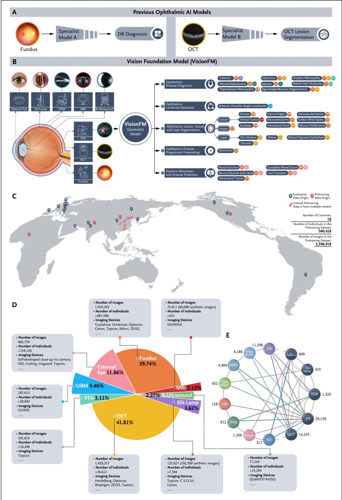

**图 1. VisionFM 概览：从任务专用走向通用眼科人工智能**

- **(A)** 以往的眼科 AI 模型是专用的：为单一目的与单一疾病（如糖网）构建，通常只关注单一模态（如眼底彩照），解决单一临床任务或流程。
- **(B)** VisionFM 是新的 AI 模型，被构建为**多用途、多疾病、多模态**的基础模型，可同时处理多个眼科临床任务，并能处理多种眼科成像模态。
- **(C)** 用于预训练与评测的数据覆盖多样地域（共 **18 个国家**）。
- **(D)** 预训练数据（340 万张图像、50 万余名参与者）覆盖由多种设备采集的 **8 种主要眼科成像模态**。
- **(E)** 多模态数据按疾病配对，用于多模态学习，实现**模态无关**的疾病诊断。
- 缩写：AMD 年龄相关性黄斑变性；DR 糖尿病视网膜病变；FFA 眼底荧光素血管造影；FP 眼底彩照；HR 高血压性视网膜病变；MRI 磁共振成像；OCT 光学相干断层扫描；RD 视网膜脱离；RVD 视网膜静脉阻塞；UBM 超声生物显微镜。
---

## 结果

### 一、眼病识别、分级，以及与临床医生的对比

为评估 VisionFM 的性能，作者在一个由 **23 个公开 + 5 个私有数据集**、覆盖 **5 种成像模态**组成的大规模基准上，把 VisionFM 与既往最先进模型（**RETFound**、**EfficientNet-B7**）在识别 **8 种眼病**上做了对比（表 1；基准细节见补充表 S2）。

VisionFM 有两种实现方式：

| 实现 | 说明 |
|---|---|
| **MA（modality-agnostic，模态无关）** | 只用**一个多分类器**，不论输入图像来自哪种成像模态，都将其分类为 8 种预定义眼病之一或"健康"。这是 VisionFM 独有的做法。 |
| **MDS（modality- and disease-specific，模态与疾病专用）** | 为**每种模态下的每种疾病**各训练一个二分类器，判断图像中是否存在该疾病。这是眼科 AI 模型的常用做法。 |

- **指标**：用分类器输出的预测概率计算 AUROC、敏感度、特异度；每项指标给出 **95% 精确 Clopper–Pearson 置信区间**。
- **要点 1**：模型表现在不同疾病与模态之间差异明显。例如**高血压性视网膜病变**对所有模型都更难准确诊断，而眼底彩照上的**视网膜静脉阻塞、近视**相对容易。
- **要点 2**：VisionFM 的 **MA 方案能超越或持平**以往"堆分类器"的模型。支撑 MA 的多模态学习方案能增强某些疾病（如高血压性视网膜病变）的诊断，但这种增益**并非对所有疾病类别都成立**。
- **要点 3**：VisionFM 的 **MDS 实现**通常能带来更高、更"专家级"的诊断准确率，在表 1 的 **16 个任务**上取得总体平均 **AUROC 0.950（95% CI 0.941–0.959）**。
- 补充表 S3、S4 给出 VisionFM 与基线方法在 **AMD 分级**与**糖网分级**上的 AUROC、敏感度、特异度；补充表 S5 给出 VisionFM 与 RETFound 在**各个公开数据集**上的多分类诊断对比。

**表 1. 不同方法在眼病诊断中的受试者工作特征曲线下面积（AUROC）、敏感度与特异度**

> 注（原文 \*）：MA 实现只训练一个分类器，用于从所有成像模态中识别所有疾病；MDS 实现则为每种模态与每种疾病分别训练一个分类器（VisionFM 与 EfficientNet 各 16 个分类器对应 16 个任务；RETFound 只有 11 个分类器对应 11 个任务，因为它只适用于眼底与 OCT 任务）。CI 为精确 Clopper–Pearson 置信区间；**†** 表示该任务的最佳结果；`-` 表示该方法不适用。

| 疾病 | 模态（测试图像数） | AUROC (95% CI) VisionFM (MA) | AUROC (95% CI) EfficientNet (MDS) | AUROC (95% CI) RETFound (MDS) | AUROC (95% CI) VisionFM (MDS) | 敏感度 (95% CI) VisionFM (MA) | 敏感度 (95% CI) EfficientNet (MDS) | 敏感度 (95% CI) RETFound (MDS) | 敏感度 (95% CI) VisionFM (MDS) | 特异度 (95% CI) VisionFM (MA) | 特异度 (95% CI) EfficientNet (MDS) | 特异度 (95% CI) RETFound (MDS) | 特异度 (95% CI) VisionFM (MDS) |
|---|---|---|---|---|---|---|---|---|---|---|---|---|---|
| 糖尿病视网膜病变 | 眼底彩照（n=3894） | 0.933(0.924-0.940) | 0.937(0.929-0.945) | 0.925(0.917-0.933) | 0.942(0.934-0.949)† | 80.91(79.2-82.5) | 83.81(82.2-85.3)† | 79.46(77.7-81.1) | 83.50(81.9-85.0) | 92.94(91.6-94.1)† | 90.03(88.5-91.4) | 92.01(90.6-93.3) | 91.52(90.1-92.8) |
| 糖尿病视网膜病变 | OCT（n=953） | 1.000(0.996-1.000)† | 0.954(0.939-0.966) | 0.971(0.959-0.981) | 1.000(0.996-1.000)† | 99.68(98.8-100.0)† | 96.61(94.9-97.9) | 92.26(89.9-94.2) | 99.68(98.8-100.0)† | 99.70(98.3-100.0) | 79.88(75.2-84.1) | 91.59(88.1-94.3) | 100.0(98.9-100.0)† |
| 糖尿病视网膜病变 | FFA（眼底荧光素血管造影）（n=130） | 0.977(0.935-0.995) | 0.959(0.909-0.986) | - | 0.998(0.969-1.000)† | 89.02(80.2-94.9) | 85.37(75.8-92.2) | - | 100.0(95.6-100.0)† | 100.0(92.6-100.0)† | 93.75(82.8-98.7) | - | 95.83(85.7-99.5) |
| 青光眼 | 眼底彩照（n=1031） | 0.932(0.915-0.947) | 0.870(0.848-0.890) | 0.876(0.855-0.896) | 0.941(0.925-0.955)† | 83.17(77.3-88.1) | 79.70(73.5-85.0) | 82.18(76.2-87.2) | 87.62(82.3-91.8)† | 90.11(87.9-92.1)† | 77.56(74.6-80.4) | 79.01(76.1-81.7) | 85.89(83.3-88.2) |
| 青光眼 | OCT（n=1777） | 0.854(0.837-0.871)† | 0.527(0.504-0.551) | 0.781(0.761-0.800) | 0.795(0.775-0.813) | 76.99(74.7-79.2) | 45.13(42.5-47.8) | 63.72(61.1-66.3) | 79.87(77.6-82.0)† | 81.24(77.2-84.9) | 61.76(56.9-66.4) | 81.71(77.7-85.3)† | 66.51(61.8-71.0) |
| 年龄相关性黄斑变性 | 眼底彩照（n=1075） | 0.860(0.838-0.881) | 0.797(0.772-0.821) | 0.844(0.821-0.865) | 0.901(0.882-0.919)† | 86.22(81.6-90.0) | 78.80(73.6-83.4) | 93.64(90.1-96.2)† | 93.29(89.7-95.9) | 73.11(69.9-76.2)† | 71.21(67.9-74.3) | 68.56(65.2-71.8) | 72.98(69.7-76.0) |
| 年龄相关性黄斑变性 | OCT（n=1296） | 0.997(0.992-0.999) | 0.987(0.979-0.992) | 1.000(0.997-1.000)† | 1.000(0.997-1.000)† | 98.03(96.9-98.8) | 98.34(97.3-99.0) | 99.79(99.3-100.0) | 99.90(99.4-100.0)† | 100.0(98.9-100.0)† | 91.89(88.4-94.6) | 100.0(98.9-100.0)† | 100.0(98.9-100.0)† |
| 白内障 | 眼底彩照（n=719） | 0.971(0.956-0.982) | 0.984(0.972-0.992) | 0.986(0.975-0.993) | 0.991(0.981-0.997)† | 91.14(82.6-96.4) | 96.20(89.3-99.2) | 92.41(84.2-97.2) | 97.47(91.2-99.7)† | 96.87(95.2-98.1) | 89.69(87.1-91.9) | 97.34(95.8-98.4)† | 96.41(94.7-97.7) |
| 白内障 | 裂隙灯（n=109） | 1.000(0.967-1.000)† | 0.995(0.957-1.000) | - | 1.000(0.967-1.000)† | 100.0(95.8-100.0)† | 95.29(88.4-98.7) | - | 100.0(95.8-100.0)† | 100.0(85.8-100.0)† | 100.0(85.8-100.0)† | - | 100.0(85.8-100.0)† |
| 高血压性视网膜病变 | 眼底彩照（n=626） | 0.854(0.824-0.881)† | 0.592(0.552-0.631) | 0.757(0.721-0.790) | 0.818(0.785-0.847) | 69.70(51.3-84.4)† | 63.64(45.1-79.6) | 57.58(39.2-74.5) | 66.67(48.2-82.0) | 91.40(88.8-93.5) | 61.89(57.8-65.8) | 94.10(91.9-95.9)† | 93.59(91.3-95.4) |
| 视网膜静脉阻塞 | 眼底彩照（n=239） | 0.931(0.891-0.959) | 0.924(0.883-0.954) | 0.939(0.901-0.966) | 0.965(0.933-0.985)† | 76.00(54.9-90.6) | 80.00(59.3-93.2) | 80.00(59.3-93.2) | 96.00(79.6-99.9)† | 99.07(96.7-99.9) | 97.20(94.0-99.0) | 100.0(98.3-100.0)† | 96.73(93.4-98.7) |
| 视网膜静脉阻塞 | FFA（眼底荧光素血管造影）（n=252） | 0.838(0.787-0.881) | 0.879(0.833-0.917) | - | 0.882(0.836-0.919)† | 95.59(91.8-98.0)† | 68.63(61.8-74.9) | - | 93.63(89.3-96.6) | 66.67(51.6-79.6) | 93.75(82.8-98.7)† | - | 77.08(62.7-88.0) |
| 近视 | 眼底彩照（n=1001） | 0.983(0.973-0.990) | 0.967(0.954-0.977) | 0.986(0.977-0.992)† | 0.985(0.975-0.992) | 93.30(88.6-96.5) | 88.83(83.3-93.0) | 93.30(88.6-96.5) | 93.85(89.3-96.9)† | 96.84(95.4-97.9)† | 96.72(95.3-97.8) | 95.62(94.0-96.9) | 96.35(94.8-97.5) |
| 近视 | B 超（B 型超声）（n=70） | 0.978(0.911-0.998) | 0.698(0.577-0.802) | - | 0.987(0.925-1.000)† | 100.0(73.5-100.0)† | 50.00(21.1-78.9) | - | 91.67(61.5-99.8) | 93.10(83.3-98.1) | 94.83(85.6-98.9) | - | 98.28(90.8-100.0)† |
| 视网膜脱离 | 眼底彩照（n=238） | 0.996(0.978-1.000) | 0.912(0.868-0.945) | 1.000(0.985-1.000)† | 1.000(0.985-1.000)† | 96.67(82.8-99.9) | 93.33(77.9-99.2) | 100.0(88.4-100.0)† | 100.0(88.4-100.0)† | 97.12(93.8-98.9) | 77.40(71.1-82.9) | 100.0(98.2-100.0)† | 100.0(98.2-100.0)† |
| 视网膜脱离 | B 超（B 型超声）（n=83） | 0.960(0.893-0.991) | 0.819(0.719-0.895) | - | 0.990(0.939-1.000)† | 96.00(79.6-99.9)† | 76.00(54.9-90.6) | - | 96.00(79.6-99.9)† | 93.10(83.3-98.1) | 81.03(68.6-90.1) | - | 98.28(90.8-100.0)† |
| **平均** | — | 0.942(0.932-0.951) | 0.863(0.846-0.879) | 0.915(0.902-0.927) | 0.950(0.941-0.959)† | 89.53(81.5-91.4) | 79.98(76.2-84.2) | 84.94(82.0-87.5) | 92.45(89.0-93.2)† | 91.95(89.6-93.3)† | 84.91(81.6-88.2) | 90.90(88.4-92.7) | 91.84(90.6-93.8) |
| **分类器数量** | — | 1 | 16 | 11 | 16 | 1 | 16 | 11 | 16 | 1 | 16 | 11 | 16 |

### 二、与不同年资眼科医生的诊断能力对比

- **任务设计**：诊断 **12 种眼病**——轻度/中度/重度非增殖性糖网（NPDR）、增殖性糖网（PDR）、青光眼、白内障、高血压性视网膜病变、近视、视网膜静脉阻塞、视网膜脱离、早期 AMD、中期 AMD。要求初级与中级眼科医生对**每张眼底彩照**选出最可能、次可能、第三可能的疾病。
- **参与者**：来自中国 **4 家眼科中心的 38 名眼科医生**——初级 **27 人**（临床经验 1–3 年）、中级 **11 人**（4–8 年）。
- **数据**：共 **180 张眼底彩照**，每张由 **4 名资深眼科医生**（临床经验 > 9 年）共识标注，每张图只有**一个"最突出疾病"标签**。其假设是：医生有能力在其前三个选择中诊断出最明显的疾病。图像被均分为三组，医生可以把同一疾病选进前三名。
- **控制临床实践差异**：由一名资深眼科医生制作讲解 12 种疾病诊断标准的**教学视频**。第 1 组（20 名医生）在观看视频**前后各诊断一次**，其余 18 人只在观看后诊断。医生之间**互相设盲**。
- **指标**：Top-K 准确率（真实标签落在前 k 个选择之内）。
- **VisionFM 侧**：用 **24 张眼底彩照**微调，每种疾病 2 张示例图（与教学视频中展示的一致）。
- **结论**：微调后的 VisionFM 诊断能力**与看过教学视频的中级眼科医生相当或更好**，且表现**更稳定**（标准差更小）。补充表 S6、S7 给出基于 top-1 诊断计算的 VisionFM 与医生的敏感度、特异度；细节见补充材料第 2.1 节。

**表 2. VisionFM 与初级、中级眼科医生在 12 种眼病诊断上的对比**

> 注（原文 \*）：VisionFM 用不同随机种子微调 5 次，以计算准确率的均值与标准差；每次微调都使用同样的 24 张示例图（每种疾病 2 张）。不同年资的医生被分为两组：第 1 组先在不看教学视频的情况下诊断，看完视频后再重新诊断一次；第 2 组只在观看视频后诊断。表中给出每组准确率与年龄分布的均值 ± 标准差。

| 眼科医生层级 | 人数 | 年龄（岁） | 性别 | Top-1 准确率（%） | Top-2 准确率（%） | Top-3 准确率（%） |
|---|---|---|---|---|---|---|
| **第 1 组：观看教学视频（讲解眼病诊断标准）之前** | | | | | | |
| 初级（临床经验 1–3 年） | 17 | 26.41±1.75 | 男 4 / 女 13 | 48.30±9.52 | 56.67±9.48 | 61.50±9.76 |
| 中级（临床经验 4–8 年） | 3 | 29.33±1.25 | 男 2 / 女 1 | 55.37±7.46 | 63.52±5.92 | 65.37±6.94 |
| **第 1 组：观看教学视频之后（同批医生复测）** | | | | | | |
| 初级（临床经验 1–3 年） | 17 | 26.41±1.75 | 男 4 / 女 13 | 54.61±8.20 | 61.80±9.00 | 65.98±10.45 |
| 中级（临床经验 4–8 年） | 3 | 29.33±1.25 | 男 2 / 女 1 | 61.48±0.26 | 64.26±2.58 | 65.93±3.28 |
| **第 2 组：仅在观看教学视频之后诊断** | | | | | | |
| 初级（临床经验 1–3 年） | 27（其中 17 人来自第 1 组） | 27.52±2.27 | 男 4 / 女 23 | 59.09±10.27 | 65.99±9.82 | 70.00±10.58 |
| 中级（临床经验 4–8 年） | 11（其中 3 人来自第 1 组） | 34.55±4.64 | 男 3 / 女 8 | 65.10±4.84 | 71.31±6.78 | 73.84±7.78 |
| VisionFM（用教学视频中每种疾病各 2 张示例图做小样本微调后） | — | — | — | 65.00±1.45 | 77.33±1.13 | 84.11±1.09 |

### 三、眼病诊断的外部验证与泛化能力

**外部验证**（3 个未纳入基准库的公开数据集，图 2A–C）。直接使用表 1 中 VisionFM 与 RETFound 的 **MDS 分类器**，**不做任何微调**：

| 数据集 | 模态 / 疾病 | 样本量 | VisionFM AUROC | RETFound AUROC |
|---|---|---|---|---|
| 巴拉圭数据集 | 眼底彩照 / 糖网 | 1437 | **0.945**（0.934–0.956） | 0.759（0.734–0.785） |
| Drishti-GS1（印度） | 眼底彩照 / 青光眼 | 101 | **0.857**（0.760–0.935） | 0.778（0.660–0.877） |
| OCTDL（俄罗斯） | OCT / AMD | 1169 | **0.974**（0.966–0.983） | 0.844（0.811–0.872） |

**泛化到新模态、新疾病、新设备**（图 2D–F）：

- **新模态（OCTA）**：尽管预训练**从未接触 OCTA**，VisionFM 在公开 DRAC 数据集（120 张）上做糖网分级的平均 AUROC 为 **0.935（0.902–0.964）**，超过此前最先进的 EfficientNet（0.921；0.885–0.953）（补充图 S1）。
- **新设备（超广角）**：在公开 DeepDRiD 数据集（100 张，含超广角成像设备拍摄的眼底彩照）上做糖网分级，平均 AUROC **0.792（0.724–0.834）**，高于 RETFound 的 0.779（0.723–0.815）（补充图 S2）。
- **小样本新疾病（眼白化病，私有数据集 n=41）**：1-shot AUROC **0.993（0.970–1.00）**，优于 RETFound（0.911；0.812–0.981）；5-shot 提升到 **0.998（0.986–1.00）**（RETFound 0.965；0.905–1.00）；10-shot 时 VisionFM **正确识别全部 41 张测试图**，再次超过 RETFound（0.976；0.924–1.00）（补充图 S3）。
- **注意**：眼白化病表型独特，仍需进一步研究来评估 VisionFM 在更复杂眼病上的小样本能力。补充表 S6、S7 显示其多病种小样本诊断表现仍有提升空间——例如在糖网分级上，初级与中级医生的敏感度和特异度高于 VisionFM。泛化研究细节见补充材料第 2.2 节。

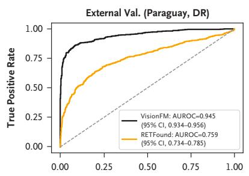
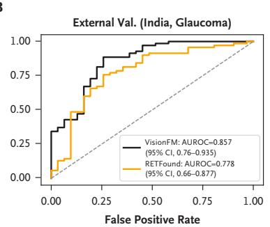
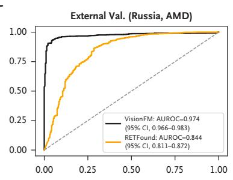
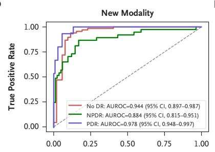
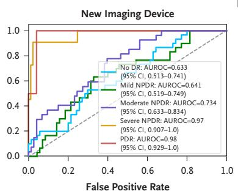
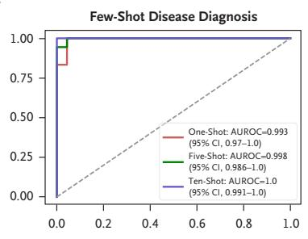
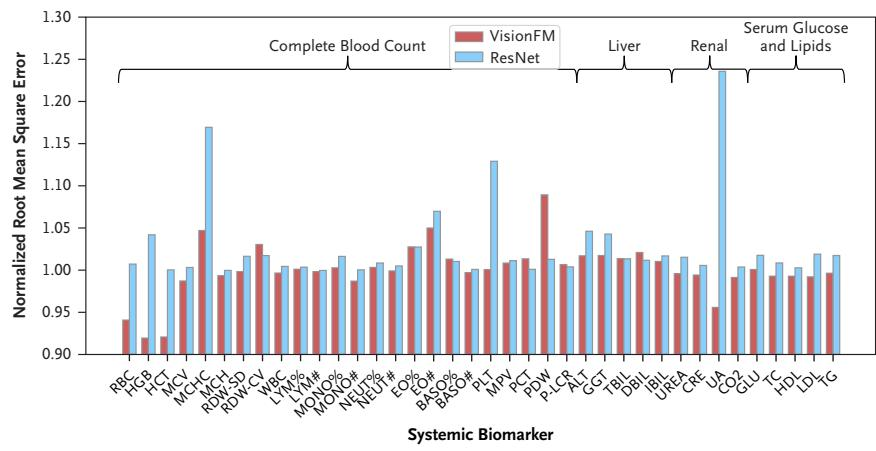
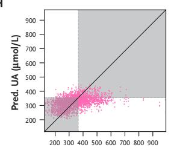
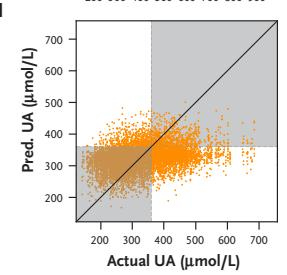

**图 2. VisionFM 的泛化能力与全身生物标志物预测**（子图 A–I 按解析文件中的图片顺序排列，可能与原刊排版次序略有出入）

- **(A)** 用巴拉圭数据集（n=1437）做基于眼底彩照的糖网识别外部验证。
- **(B)** 用 Drishti-GS1 数据集（n=101）做基于眼底彩照的青光眼识别外部验证。
- **(C)** 用 OCTDL 数据集（n=1169）做基于 OCT 的 AMD 识别外部验证。
- **(D)** 用 DRAC 数据集（n=120）以**新模态 OCTA** 做糖网分级。
- **(E)** 用 DeepDRiD 数据集（n=100）以**新设备（超广角眼底相机）**做糖网分级。
- **(F)** 用私有数据集（n=41）做**小样本眼白化病诊断**。
- **(G)** VisionFM 与 ResNet 预测 38 项生物标志物数值的归一化均方根误差（n=12,176）。
- **(H)(I)** VisionFM 对尿酸的预测值与实测值，并标出痛风的临床诊断 cutoff（≥360 µmol/l）：(H) 用外眼像预测（n=2890）；(I) 用眼底彩照预测（n=9286）。
- 缩写见文末对照表（ALT、BASO、CRE、DBIL、EO、GGT、GLU、HCT、HDL、HGB、IBIL、LDL、LYM、MCH、MCHC、MCV、MONO、MPV、NEUT、PCT、PDW、P-LCR、PLT、RBC、RDW-CV、RDW-SD、TBIL、TC、TG、UA、WBC 等）。

### 四、青光眼进展预测

- 青光眼因其**无症状、慢性**的特点，进展预测非常困难。作者用一个含 **411 名参与者**、平均随访窗口 **2.82 年**的私有数据集评估 VisionFM。
- **任务定义**：根据**本次就诊的眼底彩照**与**两次就诊之间的时间间隔**，预测该参与者在下次就诊时是否已发展为青光眼。
- **结果**：VisionFM 的 **F1 = 72.3%（95% CI 55.0–86.3）**，优于 RETFound（**60.1%**；45.0–74.3）；在准确率等其他指标上同样领先（指标以预测概率 0.5 为阈值计算）。见补充材料第 2.3 节与补充表 S8。

### 五、从眼科图像预测全身生物标志物与疾病

- 既往研究已表明全身疾病的征象可表现在眼部图像上。作者检验 VisionFM 能否**仅凭眼科图像**预测全身生物标志物与疾病。
- **数据**：含 **8217 名参与者**的私有数据集；从**眼底与外眼像**预测 **38 项**全身生物标志物，涉及血常规、肝功能、肾功能、血糖与血脂。
- **结果**：VisionFM 的平均归一化均方根误差（NRMSE）为 **1.001（0.991–1.011）**，优于常用基线模型 ResNet 的 **1.027（1.011–1.043）**（图 2G，补充表 S9）。其中 **4 项肾功能标志物**的平均 NRMSE 为 **0.985（0.954–1.015）**，提示肾脏健康与眼部健康之间可能存在关联。图 2H、2I 展示测试集上尿酸的预测值与实测值（痛风临床诊断 cutoff 为 360 µmol/l）。
- **颅内肿瘤预测**：颅内肿瘤会影响视功能，但要发现肿瘤引起的眼部图像细微改变需要全面检查，尤其当病因不明时。**此前尚无研究尝试直接从眼科图像预测颅内肿瘤**。
  - 在一个医院数据集中（**58 名参与者，35 人确诊颅内肿瘤，其中仅 9 人出现视盘水肿**），VisionFM 检测颅内肿瘤的 **AUROC = 0.986（0.960–1.00）**，精确率-召回率曲线下面积 **= 0.990（0.970–1.00）**；相比之下，中级与资深临床医生很难从眼底彩照中识别出颅内肿瘤（补充图 S4、S5，补充表 S10）。
  - 这提示 VisionFM 有可能识别出人类不易察觉的模式与全身关联。但由于数据量有限，此处采用了交叉验证，**仍需更大样本的研究确认**这一初步发现。见补充图 S6 与补充材料第 2.4 节。

### 六、眼部病灶、血管、分层分割与关键点检测

分割及相关能力是衡量医学影像基础模型性能的关键。图 3A 汇总了 VisionFM 在一个包含 **22 个公开 + 1 个私有数据集**的综合基准上的各类分割任务表现（补充表 S11–S13）。

| 任务 | VisionFM | 对比基线 |
|---|---|---|
| 眼底彩照血管分割（Dice） | **81.75%** | — |
| 眼底彩照病灶分割（Dice） | **42.07%** | — |
| OCT 分层分割（Dice） | **96.18%** | RETFound 94.98%；U-Net 89.70% |
| OCT 病灶分割（Dice） | **64.65%** | RETFound 62.19%；U-Net 52.48% |
| MRI 眼眶肿瘤分割（Dice） | **79.49%** | U-Net 41.69%（RETFound 不适用 MRI/UBM） |
| UBM 关键点检测（3 个点，平均欧氏距离误差） | **4.90 像素** | U-Net 12.85 像素 |

- Dice 相似系数衡量预测掩膜与真实掩膜的重叠程度。UBM 关键点检测可用于**房角的定量测量**（数据集细节见补充表 S14，结果见补充表 S15）。
- **小样本分割**（OCT 分层，图 3B）：VisionFM 的 **1-shot（Dice 77.54%）超过 U-Net 的 10-shot（76.07%）**，也显著高于 RETFound 的 1-shot（59.71%）。
- 图 3C 给出这些结果的定性对比；更多细节见补充材料第 2.5、2.6 节与补充图 S7、S8。
- 补充图 S9 展示了 VisionFM 的**可解释性**——对眼科影像表征给出可视化解释，这是建立对 AI 模型信任的关键特性。

### 七、合成眼科影像数据的有效性

- 基础模型需要大量预训练数据，但某些不常开展的成像模态（如眼眶 MRI）数据难以收集，**合成数据是扩充数据集的潜在方案**。
- 补充图 S10 比较了 VisionFM 的**裂隙灯与 MRI 编码器**在真实数据、合成数据以及不同比例混合下的表现（这两种模态的真实数据远少于其余 6 种）。结果显示：**合适的真实:合成比例能提升性能，裂隙灯与 MRI 的最优比例都是 1:5（真实:合成）**。
- 值得注意的是，**只用真实数据与只用合成数据训练得到的准确率相近**，提示合成数据有替代真实数据、促进数据共享的潜力。
- 补充图 S11 给出研究中使用的合成裂隙灯与 MRI 图像示例；补充图 S12 是**视觉图灵测试**结果（邀请眼科医生、放射科医生、神经外科医生判断每张图像是合成还是真实，补充表 S16）：合成裂隙灯得分 **42.7% ± 12.1%**，合成 MRI 得分 **51.6% ± 4.5%**——越接近 50% 说明临床医生越接近随机猜测。细节见补充材料第 1 节。
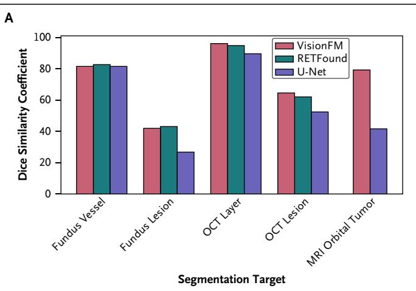
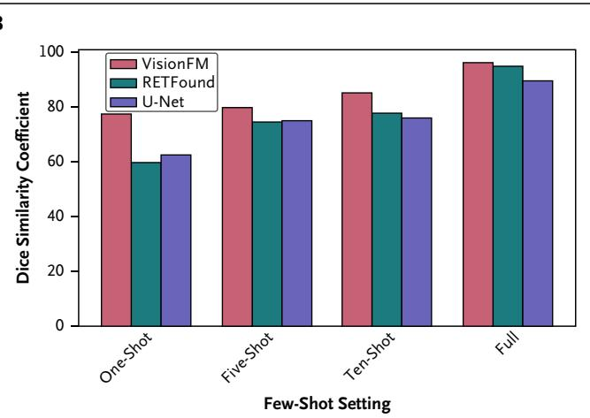
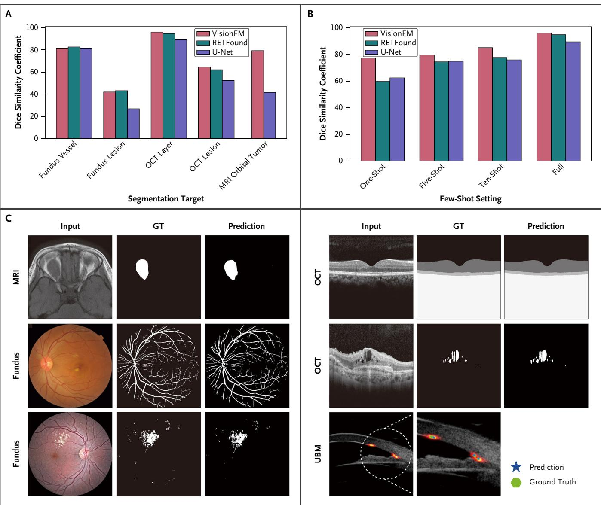

**图 3. VisionFM 的分割与检测结果**

- **(A)** VisionFM 的定量分割结果，以及在包含 22 个公开 + 1 个私有数据集的基准上与 RETFound、U-Net 的对比。眼底血管、眼底病灶、OCT 分层、OCT 病灶、MRI 眼眶肿瘤分割的测试图像数分别为 **367、698、396、900、41**。
- **(B)** VisionFM 的小样本 OCT 分层分割性能，以及与 RETFound、U-Net 的对比（396 张测试图）。
- **(C)** VisionFM 在不同成像模态上分割与关键点检测的定性示例。
- 缩写：GT 金标准（真值）；MRI 磁共振成像；OCT 光学相干断层扫描；UBM 超声生物显微镜。

---

## 讨论

随着 AI 成为主流医疗技术，它应当被增强到能解决**更广泛、更复杂**的临床任务，以应对公共卫生与全球健康挑战。本文提出的 VisionFM 是一个具备**通才智能**的新型综合眼科影像基础模型，在多种眼科成像模态与临床任务上都稳定达到最先进的准确率。

其价值主要体现在：

- **适配后达到专家级诊断准确率**——考虑到全球眼科实践的差异，这对难以获得高质量诊断的地区尤其有用。
- 能**分割眼部病灶、血管、分层**并**检测眼部关键点**，为临床医生提供**可解释的决策支持**。
- 具备**小样本学习能力**，可大幅降低标注与计算成本。
- 展现**多方面的泛化能力**与对数据集偏移的鲁棒性，例如从未在预训练中见过 OCTA，却能泛化到 OCTA 图像做糖网分级。
- 为评估其通才智能，作者**引入并基准化了一系列新眼科任务**，如眼眶肿瘤分割与颅内肿瘤预测。
- 证明**合适的真实:合成数据比例可提升性能**，支持需要隐私保护数据共享的合作项目。

### 局限性

1. **人群偏倚**：预训练数据在人群构成上虽然多样，但私有数据量超过公开数据，可能**偏向中国人群**，因此 VisionFM 在中国数据上通常准确率更高。尽管如此，它在包含多族裔的基准上仍表现出色；更均衡、更具包容性的预训练数据集可进一步提升准确率与泛化性。
2. **小规模应用需再验证**：用眼底彩照预测颅内肿瘤对社区级筛查与眼科门诊场景很有前景，但该应用的数据集规模小，需要进一步验证；而且颅内肿瘤的确诊必须综合患者病史、其他影像与临床信息。同样，青光眼进展预测也需要**更大规模的验证集**才能更可靠地评估（这有助于早期干预）。
3. **全身标志物预测尚未达临床标准**：从眼部图像预测全身生物标志物（如与痛风相关者），对那些平时不会检查血指标的人群有价值，但目前诊断准确率**还达不到广泛临床转化的标准**。
4. **可能低估医生能力**：VisionFM 在 12 种眼病（眼底彩照）诊断上与中级眼科医生相当，但医生实际诊断时往往会结合**额外临床信息与其他成像模态**；当被限制只能使用眼底彩照时，医生的诊断能力可能被低估。
5. **对比研究仅纳入中国医生**：考虑到医学培训与眼科专科实践可能存在差异，未来需要**多国、更大规模、更多样**的研究，才能更客观地比较 VisionFM 与更广泛的眼科医生群体。
6. **模态/疾病/任务覆盖仍不完整**：还有许多模态、疾病（尤其是罕见病）与临床任务尚未纳入与评测。得益于 VisionFM 的灵活设计，可通过**新增编码器**与**解码器的样本高效微调**把新模态、新疾病、新任务纳入现有结构；随着更多数据可得，其临床效用可以扩展并得到验证。此外，它还可以与**大语言模型**结合以生成诊断报告。

**小结**：作为多模态多任务的通才基础模型，VisionFM 有效覆盖了 8 种眼科临床成像模态与大量临床任务；通过自监督预训练与有监督微调纳入新的成像模态与任务，其功能可以扩展，从而应对更广泛的眼科疾病与临床挑战。

---

## 披露、资助与数据可及性

- **作者披露**：见 ai.nejm.org。
- **资助**：香港特别行政区研究资助局 RGC（ECS24211020、GRF14203821、GRF14216222、GRF14201824）；香港创新及科技基金（ITS/252/23）；深圳市科技创新委员会（SGDX20220530111005039）；国家自然科学基金（81730027、82130029）；北京市自然科学基金（L212036）。Kyle Lam 获英国国家健康与照护研究院（NIHR）学术临床研究员资助。
- **数据**：用于开发与验证 VisionFM 的公开数据，其原始文献见补充表 S1、S2、S5、S11、S12；各公开数据集的下载链接见其原始论文，或联系原作者（需其批准）。**预训练所用的私有数据不对外公开**；欢迎合作，受控访问私有数据的申请将逐案评估，并需机构伦理审查委员会批准。**代码、模型权重、部分私有评测数据集与合成数据集**可从项目网站下载：https://github.com/ABILab-CUHK/VisionFM

### 作者单位（编号对应原文上标）

| 编号 | 单位 |
|---|---|
| 1 | 香港中文大学生物医学工程系 |
| 2 | 首都医科大学附属北京同仁医院 北京同仁眼科中心 |
| 3 | 河南省医学科学院（郑州） |
| 4 | 伦敦国王学院（King's College London）信息学系 |
| 5 | 首都医科大学放射学系 |
| 6 | Intelligent Vision Plus Technology Co.（深圳） |
| 7 | 中山大学生命科学学院（广州） |
| 8 | 北京大学健康科学中心 精准神经外科与肿瘤中心 |
| 9 | SightAI Technology Pte（新加坡） |
| 10 | 邯郸市眼科医院 |
| 11 | 西安交通大学第一附属医院眼科 |
| 12 | 成都中医药大学眼科学院 |
| 13 | 中南大学湘雅医院眼科中心（长沙） |
| 14 | 山西医科大学附属山西眼科医院（太原） |
| 15 | 帝国理工学院 外科与癌症系 |
| 16 | Precision Robotics（香港） |
| 17 | 帝国理工学院医学院 |
| 18 | 新加坡国立大学杨潞龄医学院 创新与精准眼健康中心 & 眼科系 |
| 19 | 清华大学 清华医学（Tsinghua Medicine） |
| 20 | 北京清华长庚医院 |
| 21 | 新加坡眼科研究所 / 新加坡国家眼科中心 |

> **参考文献**：原文共 40 条英文文献（编号 1–40），未翻译，见 [[full|full.md]] 的 References 部分。正文中的上标数字即对应文献编号。

---

## 附录：缩写对照表

| 缩写 | 英文全称 | 中文 |
|---|---|---|
| ALT | alanine transaminase | 丙氨酸氨基转移酶 |
| AMD | age-related macular degeneration | 年龄相关性黄斑变性 |
| AUROC | area under the receiver operating characteristic curve | 受试者工作特征曲线下面积 |
| BASO | basophils | 嗜碱性粒细胞 |
| CI | confidence interval | 置信区间（Clopper–Pearson 精确法） |
| CRE | creatinine | 肌酐 |
| DBIL | direct bilirubin | 直接胆红素 |
| DeepDRiD | Deep Diabetic Retinopathy Image Dataset | 深度糖网图像数据集（超广角） |
| DR | diabetic retinopathy | 糖尿病视网膜病变（糖网） |
| DRAC | Diabetic Retinopathy Analysis Challenge | 糖网分析挑战赛数据集 |
| EO | eosinophils | 嗜酸性粒细胞 |
| FFA | fundus fluorescein angiography | 眼底荧光素血管造影 |
| FP | fundus photographs | 眼底彩照 |
| GGT | gamma-glutamyl transferase | γ-谷氨酰转移酶 |
| GLU | blood glucose | 血糖 |
| GT | ground truth | 金标准 / 真值 |
| HCT | hematocrit | 血细胞比容 |
| HDL | high-density lipoprotein | 高密度脂蛋白 |
| HGB | hemoglobin | 血红蛋白 |
| HR | hypertensive retinopathy | 高血压性视网膜病变 |
| IBIL | indirect bilirubin | 间接胆红素 |
| LDL | low-density lipoprotein | 低密度脂蛋白 |
| LYM | lymphocytes | 淋巴细胞 |
| MA | modality-agnostic | 模态无关（单一多分类器） |
| MCH | mean corpuscular hemoglobin | 平均红细胞血红蛋白量 |
| MCHC | mean corpuscular hemoglobin concentration | 平均红细胞血红蛋白浓度 |
| MCV | mean corpuscular volume | 平均红细胞体积 |
| MDS | modality- and disease-specific | 模态与疾病专用（每任务一个二分类器） |
| MONO | monocytes | 单核细胞 |
| MPV | mean platelet volume | 平均血小板体积 |
| MRI | magnetic resonance imaging | 磁共振成像 |
| NEUT | neutrophils | 中性粒细胞 |
| NPDR | nonproliferative diabetic retinopathy | 非增殖性糖网 |
| NRMSE | normalized root mean square error | 归一化均方根误差 |
| OCT | optical coherence tomography | 光学相干断层扫描 |
| OCTA | OCT angiography | OCT 血管成像 |
| OCTDL | OCT Dataset for image-based deep learning methods | 面向图像深度学习方法的 OCT 数据集（俄罗斯） |
| PCT | plateletcrit | 血小板压积 |
| PDR | proliferative diabetic retinopathy | 增殖性糖网 |
| PDW | platelet distribution width | 血小板分布宽度 |
| P-LCR | platelet–large cell ratio | 大型血小板比率 |
| PLT | platelet count | 血小板计数 |
| RBC | red blood cell count | 红细胞计数 |
| RD | retinal detachment | 视网膜脱离 |
| RDW-CV | red cell distribution width–coefficient of variation | 红细胞分布宽度变异系数 |
| RDW-SD | red cell distribution width–standard deviation | 红细胞分布宽度标准差 |
| RVD | retinal vein occlusion | 视网膜静脉阻塞 |
| TBIL | total bilirubin | 总胆红素 |
| TC | total cholesterol | 总胆固醇 |
| TG | triglycerides | 甘油三酯 |
| UA | uric acid | 尿酸 |
| UBM | ultrasound biomicroscopy | 超声生物显微镜 |
| WBC | white blood cell count | 白细胞计数 |
