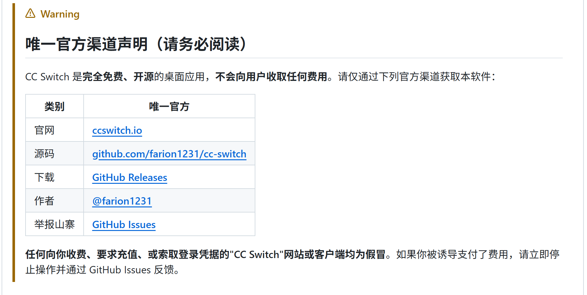
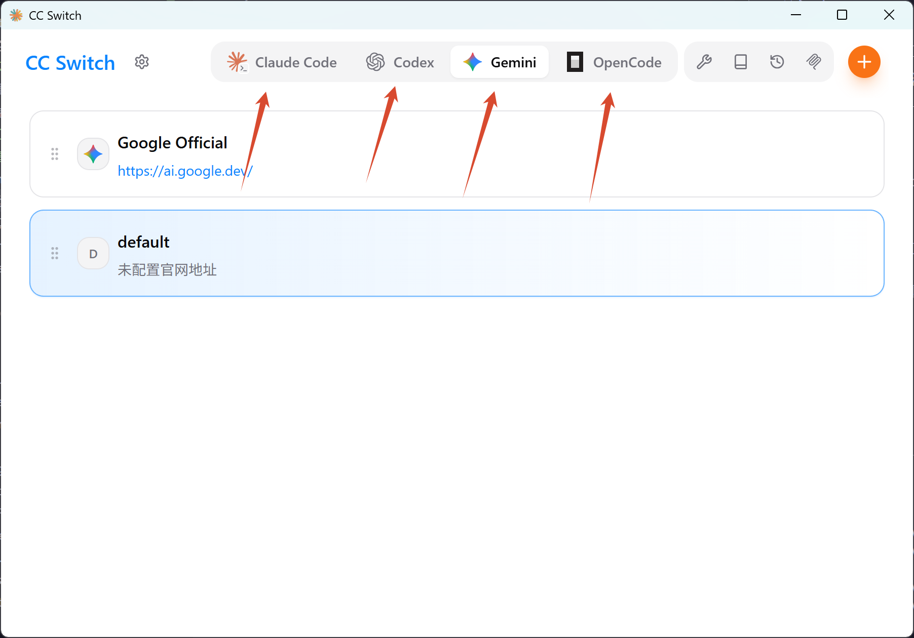
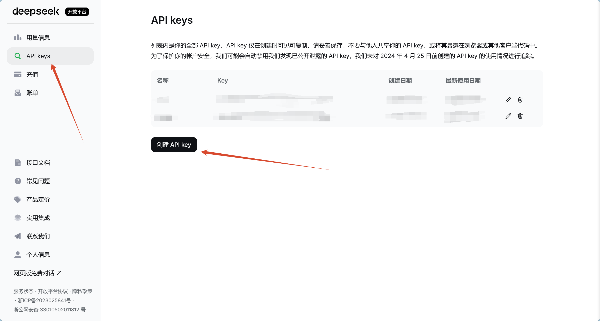
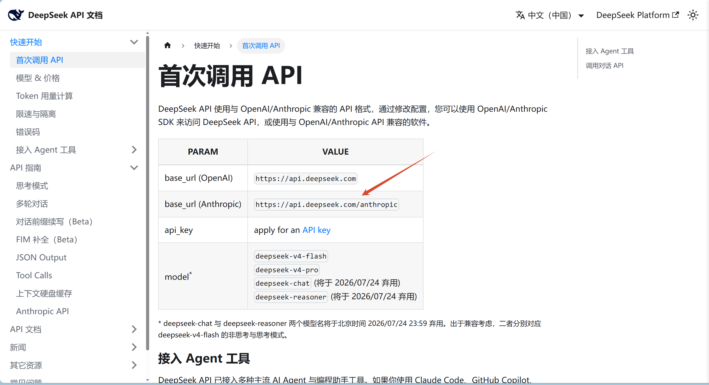
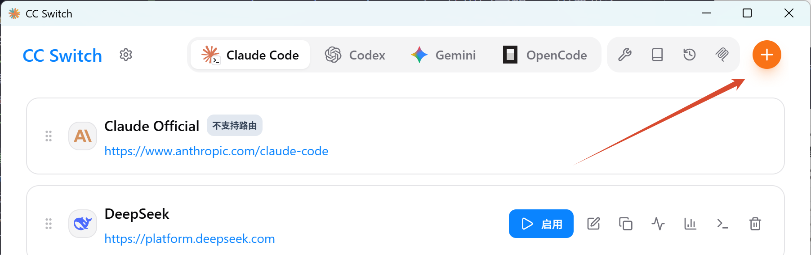
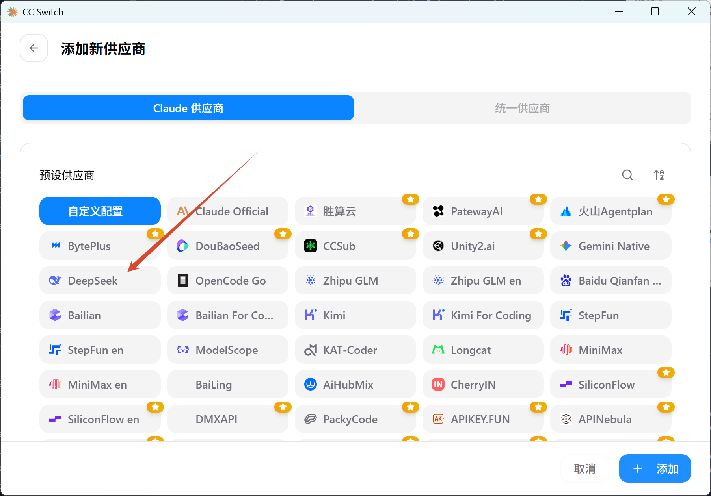
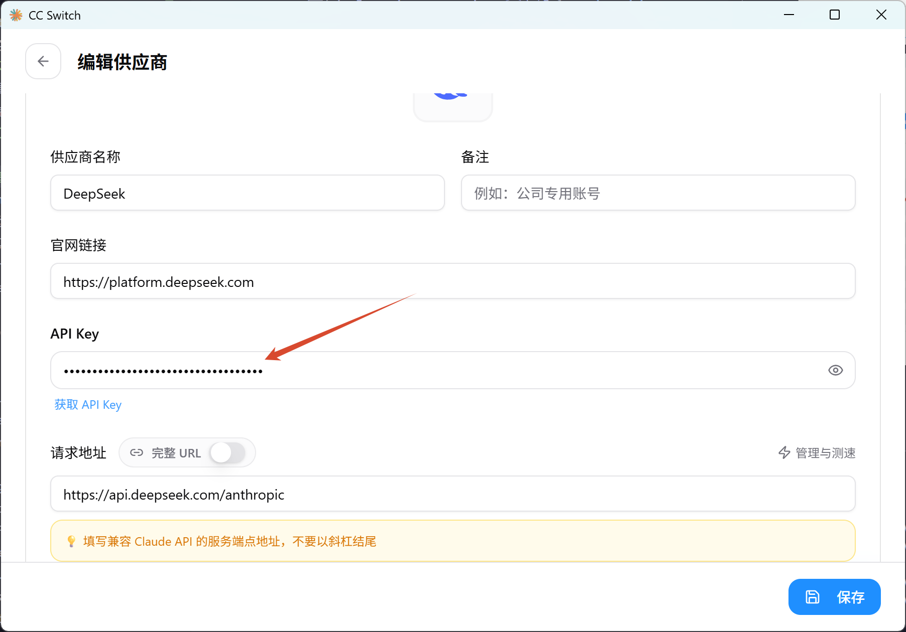
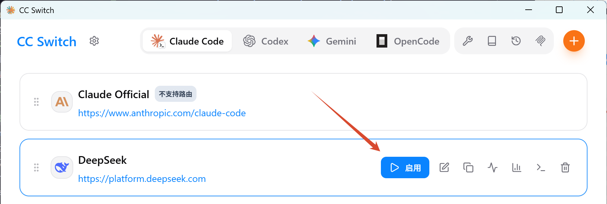
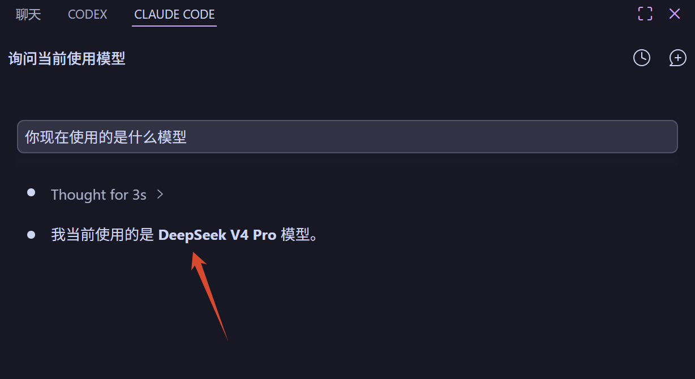

## 前言

现在比较常见的AI工具，比如 claudecode、codex、opencode，都有一套自己的配置方法，这种方法在此文中不重复叙述，如果想了解可以参考智谱参考文档或者其他模型的参考文档的一些方法来引入第三方中转模型来驱动这些AI工具。

我主要写如何用 ccswitch 来统一配置这些AI工具。

## 下载 ccswitch

前往 [ccswitch 官网](https://www.ccswitch.io/zh/) 下载 ccswitch

下载之后可以打开

## 配置

一般的中转站使用的是 sub2api 这个项目，会自带导入到ccs的选项。这里讲一下不用这些中转站，而是使用一些官方的模型如何配置。以 deepseek 为例。

1. 前往 [deepseek 官网](https://platform.deepseek.com/usage)。使用官方的api需要先充值，有一定金额才能使用。

2. 前往 API Keys 界面，并创建api key

创建之后记得保存好

3. 查阅 [deepseek api 文档](https://api-docs.deepseek.com/zh-cn/)。

4. 在 ccs 界面的 claudecode 处点击添加供应商。添加ds的供应商

5. 填写 apikey

6. 启用配置

7. 打开 vscode 正常用即可
