## 1. 前言

Obsidian 的一个仓库（Vault）本质上就是一个普通文件夹：笔记以 Markdown 文件保存，
插件和界面等配置保存在 `.obsidian/` 目录中。你在 Obsidian 中看到的内容，都是这些本地
文件的可视化结果。

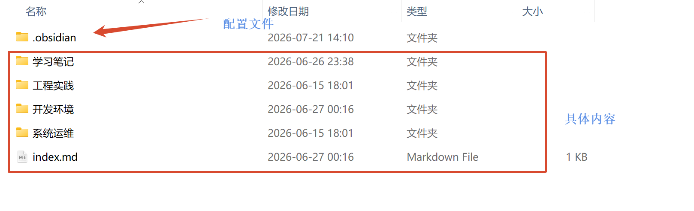

Git 擅长记录和同步文本文件的变更，因此可以把整个 Vault 作为 Git 仓库管理，再借助
GitHub、Gitee 等远程仓库在多台设备间同步。下文以 Gitee 为例，GitHub 的流程相同。

> [!note]
> 使用 Git 同步需要在每台设备上安装 Git，并完成基本身份配置。Git 的常用命令可参考 [[useGit.md]]。

## 2. 在 Vault 中使用终端

Git 是命令行工具。Obsidian 默认不提供终端，但可以通过以下任一方式在 Vault 根目录执行
Git 命令。

### 2.1. 在系统终端中打开

在文件管理器中打开 Obsidian Vault 所在文件夹，右键后选择“在终端中打开”。终端打开后，
当前工作目录就是该 Vault。

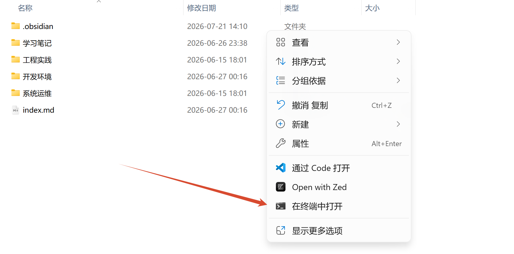

首次使用时，在这里初始化仓库：

```bash
git init
```

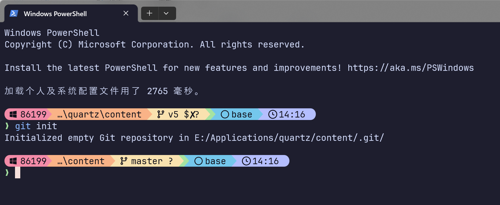

之后可通过 `git status` 确认当前仓库状态。

### 2.2. 在 Obsidian 中使用终端插件

如果希望不离开 Obsidian，可以安装终端插件。这里以 `termy` 为例：在社区插件市场中搜索并
安装，然后启用插件。

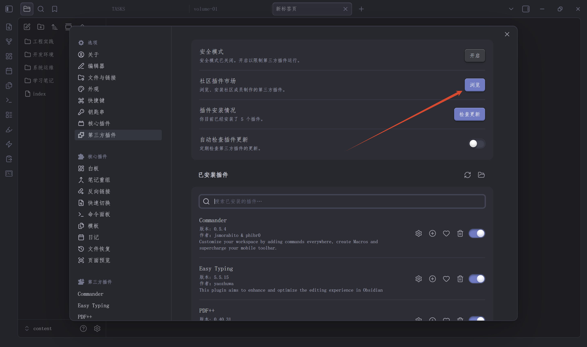

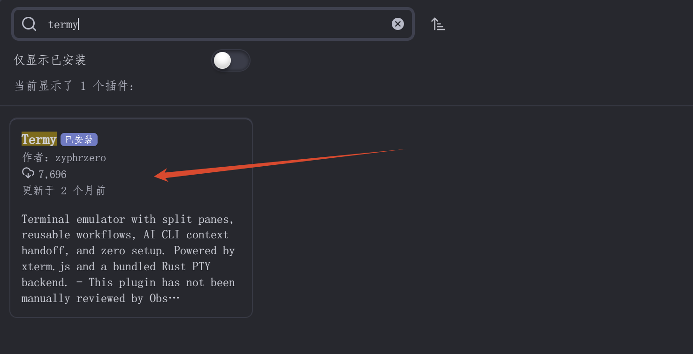

启用后，可以从左侧工具栏打开终端。

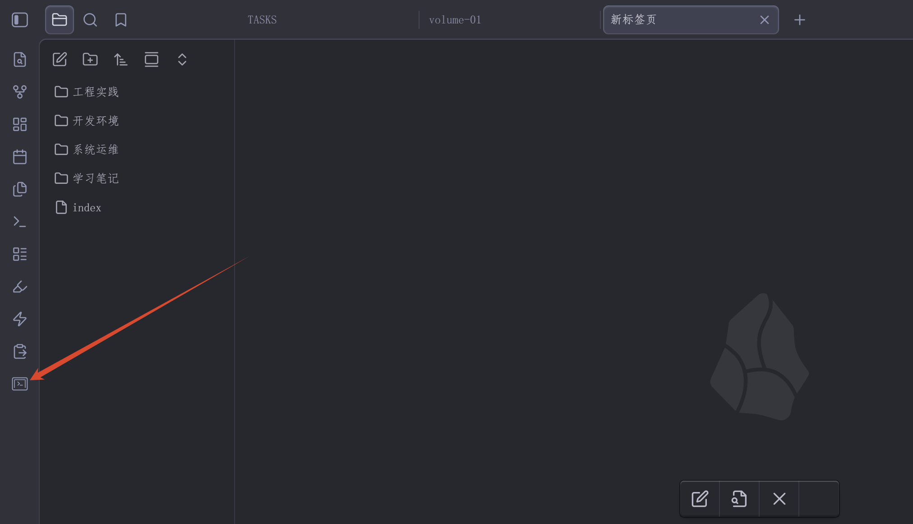

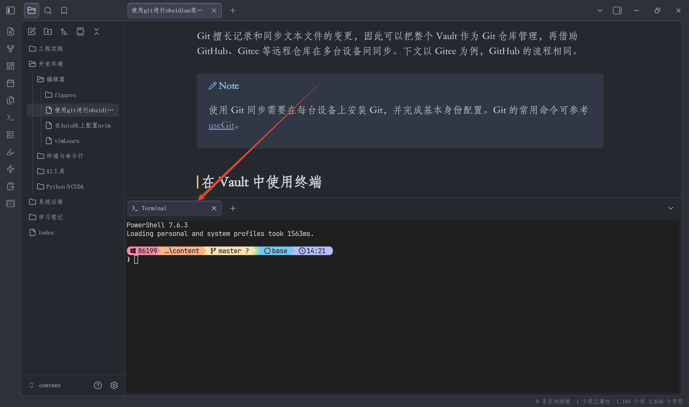

## 3. 首次配置同步

### 3.1. 创建远程仓库

在 Gitee 新建一个仓库，用于保存笔记。建议创建**私有仓库**，避免笔记内容被公开。
首次从本地推送时，请创建空仓库，不要勾选初始化 README、`.gitignore` 或许可证，以免
本地和远程产生无关历史。

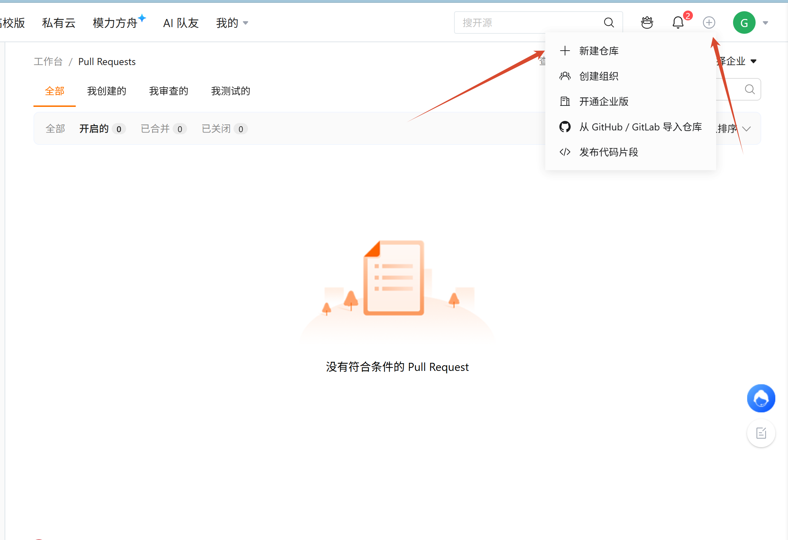

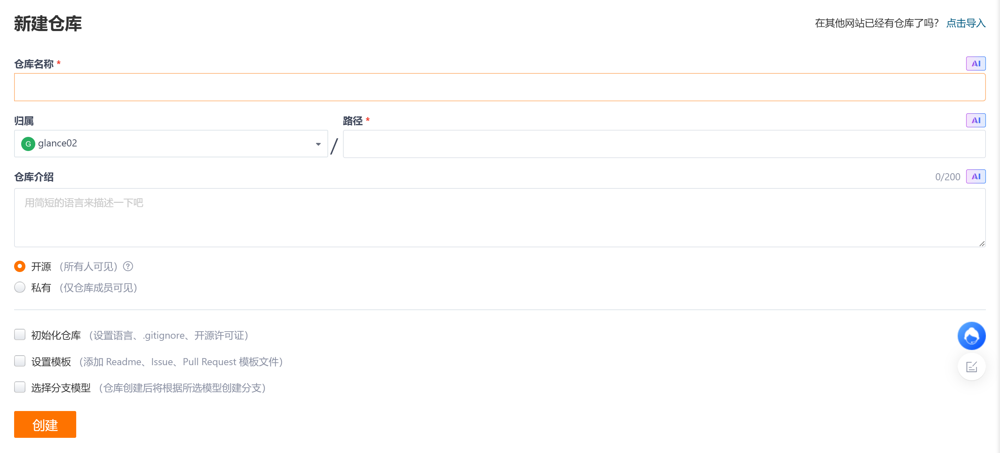

创建完成后，复制仓库的 SSH 或 HTTPS 地址。

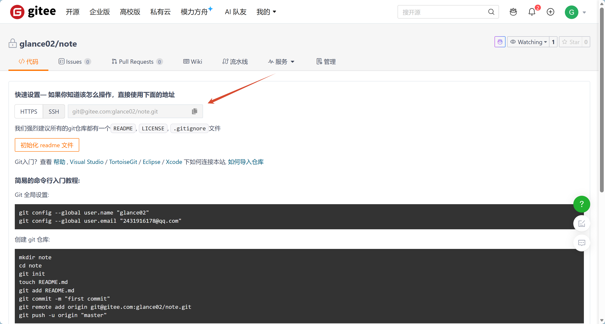

### 3.2. 初始化本地仓库并推送

在 Vault 根目录执行以下命令，将本地笔记提交并推送到远程仓库。将
`<远程仓库地址>` 替换为刚才复制的地址：

```bash
git init
git add .
git commit -m "init obsidian vault"
git branch -M main
git remote add origin <远程仓库地址>
git push -u origin main
```

其中，`origin` 是远程仓库的默认名称；首次 `push` 中的 `-u` 会建立本地 `main` 分支与
远程分支的追踪关系，之后便可以直接使用 `git push` 和 `git pull`。

可以使用以下命令确认远程地址是否添加成功：

```bash
git remote -v
```

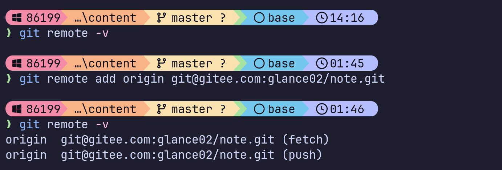

## 4. 日常同步流程

### 4.1. 在当前设备提交并上传

每次修改笔记后，先查看改动，再提交并推送：

```bash
git status
git add .
git commit -m "update notes"
git push
```

提交信息应简要说明本次修改，例如 `add cuda notes` 或 `update weekly review`。如果只想提交
某个文件，可以将 `git add .` 替换为 `git add <文件路径>`。

### 4.2. 在另一台设备下载或更新

新设备首次使用时，选择一个本地文件夹并克隆仓库：

```bash
git clone <远程仓库地址>
```

然后在 Obsidian 中选择“打开文件夹作为仓库”，并指定刚克隆下来的目录。之后每次开始编辑前
和结束编辑后，分别执行：

```bash
git pull
git add .
git commit -m "update notes"
git push
```

开始编辑前先 `git pull`，可以减少多台设备同时修改同一文件时的冲突。若确实发生冲突，先用
`git status` 找到冲突文件，手动保留正确内容后再执行 `git add` 和 `git commit`。

## 5. 配置与安全注意事项

- 默认将 `.obsidian/` 一并提交，可以同步插件、主题和大部分设置；不同设备的窗口布局可能
  不同，必要时可把对应的工作区文件加入 `.gitignore`。
- 不希望同步的文件或目录可以写入 Vault 根目录的 `.gitignore`，例如：

```gitignore
.obsidian/workspace.json
.obsidian/workspace-mobile.json
.trash/
```

- 远程地址可以使用 HTTPS 或 SSH。HTTPS 上手更直接；SSH 需要在每台设备生成密钥，并将公钥
  添加到 Gitee 或 GitHub 账户中。
- Git 会保留每次提交的历史。不要把密码、私钥或其他敏感信息提交到仓库；即使之后删除，内容
  仍可能存在于历史记录中。

## 6. 相关笔记

- [Git 常用流程与命令速查](../终端与命令行/useGit.md)
