反向可达集（RR set）。IMM（Influence Maximization via Martingales）是解决**影响力最大化**问题的经典算法，由 Tang et al. 2015 年提出。这里的"反向可达集"与控制理论中的含义不同，是一个纯图论概念。

---

## 问题背景：影响力最大化

给定社交网络图 $G = (V, E)$，每条边 $(u, v)$ 有传播概率 $p_{uv}$，目标是：

> 选出 $k$ 个"种子"节点，使其在 IC（独立级联）或 LT（线性阈值）模型下，期望影响的节点数 $\sigma(S)$ 最大。

暴力枚举是 NP-Hard 的，IMM 给出了一个 $(1 - 1/e - \varepsilon)$-近似的高效算法。
## 反向可达集（RR Set）的核心定义

在 IMM 中，"反向可达集"不是控制论的意思，而是一个**在反向传播图上的随机可达集合**。

给定图 $G$，对每条边独立地以概率 $p_{uv}$ 保留，得到一个随机图 $g$。在 $g$ 中，从节点 $v$ 出发**沿边反向**（即逆着有向边走）所能到达的所有节点，就构成以 $v$ 为根的一个反向可达集（Reverse Reachable Set），记作 $\text{RR}(v, g)$。

---

## 为什么 RR 集能估计影响力？

这是 IMM 最核心的数学洞见，来自以下等价关系：

$$\mathbb{E}[\sigma(S)] = n \cdot \Pr[\text{RR}(v) \cap S \neq \emptyset]$$

其中 $v$ 是随机均匀选取的节点，$n$ 是总节点数。

**直觉解释**：如果种子集 $S$ 中有节点能正向到达 $v$，等价于 $v$ 的 RR 集中包含了 $S$ 的某个节点。因此，"$S$ 的期望影响范围"可以转化为"随机 RR 集被 $S$ 覆盖的概率"，后者只需采样估计，无需穷举传播过程。

---

## IMM 算法的两个阶段

### 阶段一：生成足够多的 RR 集

反复随机选一个节点 $v$，在随机图 $g$（对每条边独立采样）中做 BFS/DFS 反向遍历，收集 $v$ 的 RR 集。重复 $\theta$ 次（$\theta$ 由理论保证的误差界计算得出）。

```
θ 的计算涉及参数 ε（近似精度）、δ（失败概率）、k（种子数量），
大约在 O((k + l)(n + m) log n / ε²) 量级
```

### 阶段二：贪心最大覆盖

有了 $\theta$ 个 RR 集之后，问题变成经典的**最大覆盖问题**：选 $k$ 个节点，使其覆盖尽可能多的 RR 集（被覆盖 = 该 RR 集中至少含一个种子）。

贪心策略每轮选出覆盖 RR 集最多的节点，加入种子集 $S$，并从所有 RR 集中移除已被覆盖的，重复 $k$ 次。

```
贪心最大覆盖有 (1 - 1/e) ≈ 63.2% 的理论近似保证
```

---

## 完整算法流程



## 关键性质与复杂度

**时间复杂度**：$O\big((k + l)(n + m) \varepsilon^{-2} \log n\big)$，其中 $m$ 为边数，$l$ 为置信参数。相比 CELF（反复模拟蒙特卡洛）快了数个数量级。

**无偏性**：每个 RR 集的构造是无偏采样，因此用 RR 集覆盖率来估计影响力是统计无偏的。

**与传播模型的关系**：RR 集的反向 BFS 天然适配 IC 模型。对 LT（线性阈值）模型，只需修改采样方式（每个节点随机选一条入边保留），同样成立。

---

## 一句话总结

> IMM 中的反向可达集是"如果我被激活，哪些人可能是激活源头"的集合。它把正向的"谁能影响多少人"问题，转化为反向的"谁覆盖了最多潜在受众"问题，从而可以用高效的随机采样+贪心来精确近似。

