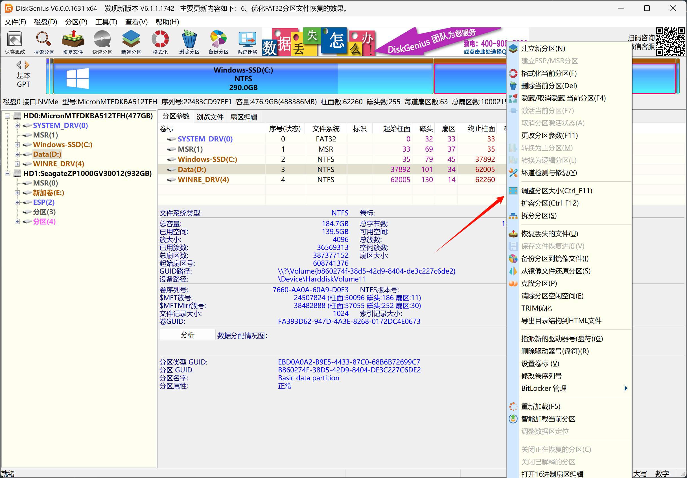
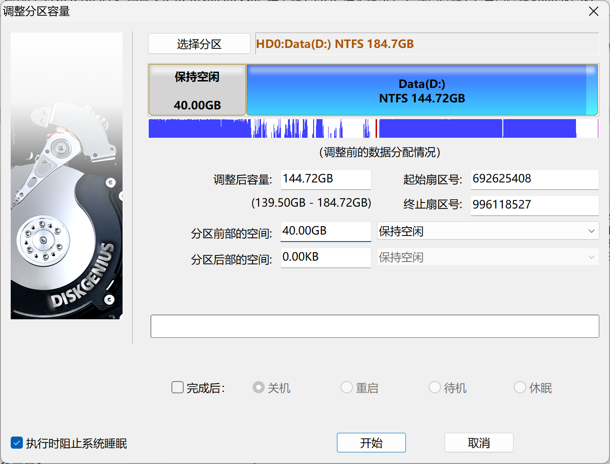
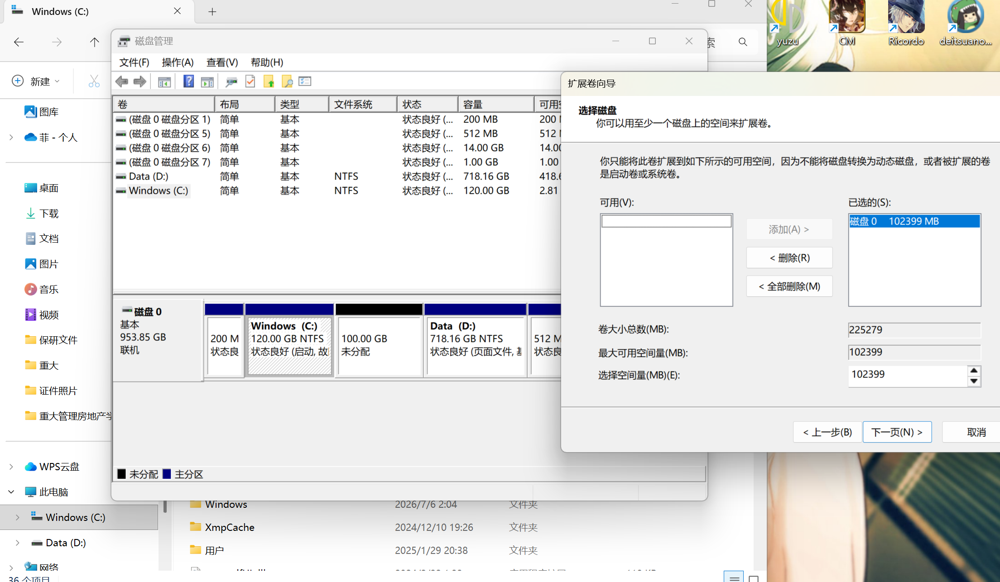
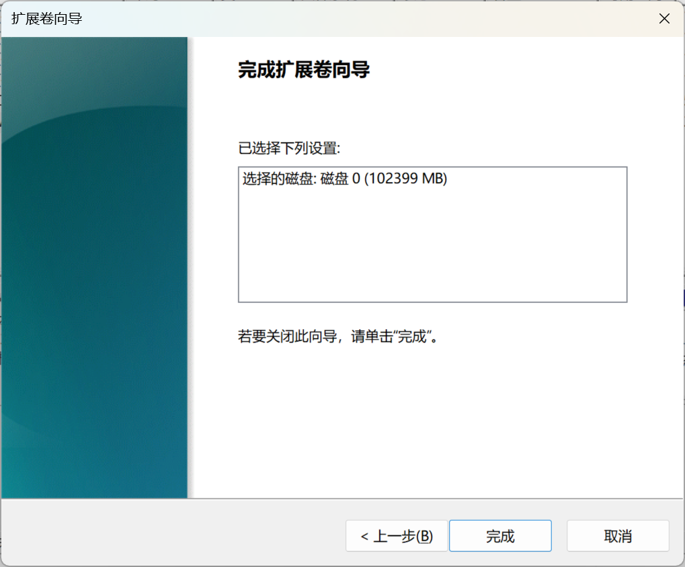
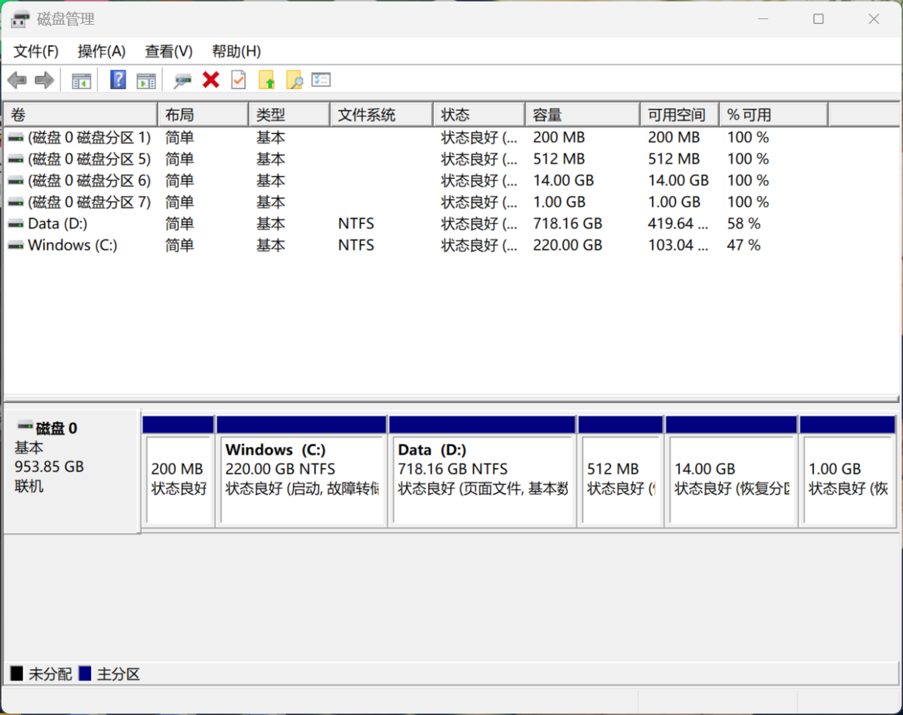

## 前置条件检查

**检查C盘和D盘是否在一块内存条上**。

最简单的办法是先打开磁盘管理：

查看C盘和D盘是否在同一行上。

如果不在的话，就不能使用此方法。一般都是在的。如果在的话，就可以去下载disk genius。使用到disk genius和系统自带的磁盘管理工具来拓展C盘。
## 安装Disk Genius

把diskgenius安装在非D盘。
## 调整D盘分区

1. 在diskgenius里面右键d盘调整分区大小。

2. 前部空间里填入希望转移的空间的大小

按操作完成即可。

## 拓展C盘

在桌面右键我的电脑-管理-磁盘管理

这里可以看到C盘和D盘中间出现了“未分配”的空间，这是之前在disk genius 中转移出来的空间。（两次照片用的不同，后者是我朋友发给我的照片）

在里面右键C盘，再点击扩展卷

过完自带的向导

即可得到空间
